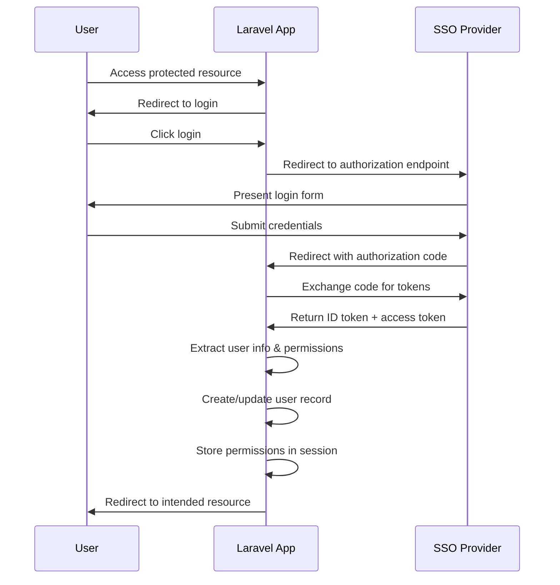

# Design Document

## Overview

This design outlines the migration from the current custom authentication system (`login/login2` and `pls`) to a modern SSO system using OpenID Connect. The new system will leverage the `jumbojett/openid-connect-php` library to implement standard OIDC flows while maintaining the application's authorization model through structured permissions delivered via custom claims.

The migration will completely replace the existing authentication infrastructure, simplifying the codebase and providing a more secure, standards-based approach to user authentication and authorization.

## Architecture

### High-Level Flow



### Authentication Flow

1. **Authorization Request**: User is redirected to SSO with OpenID Connect parameters including the `permissions` scope
2. **Token Exchange**: Authorization code is exchanged for tokens using the OIDC client library
3. **User Processing**: ID token claims are extracted to create/update user records
4. **Permission Loading**: Custom `permissions` claim is parsed and stored in session
5. **Session Management**: User is logged in with Laravel's authentication system

### Permission Model

The new permission system maps SSO permissions to application functionality:

- **Permission Structure**: `{ "id": "permission-name", "scope": "entity-or-wildcard" }`
- **Permission Types**:
  - `manage`: Manage bookings and view booking information (scope: entity name or `*`)
  - `admin`: Super admin access (scope: `null`)

## Components and Interfaces

### SSO Service

**Purpose**: Handles OpenID Connect operations and token management

**Key Methods**:
- `getAuthorizationUrl()`: Generate authorization URL with proper scopes
- `handleCallback($code)`: Process authorization code and return user data
- `extractUserInfo($idToken)`: Parse user information from ID token
- `extractPermissions($idToken)`: Parse permissions from custom claim
- `logout()`: Handle SSO logout flow

**Configuration**:
```php
// Environment variables needed
SSO_CLIENT_ID=your_client_id
SSO_CLIENT_SECRET=your_client_secret  
SSO_ISSUER_URL=https://sso.example.com
SSO_REDIRECT_URI=https://app.example.com/auth/callback
```

### Updated AuthController

**Purpose**: Orchestrate authentication flow using SSO service

**Key Methods**:
- `getLogin()`: Redirect to SSO authorization endpoint
- `getCallback()`: Handle SSO callback and complete authentication
- `getLogout()`: Clear session and redirect to SSO logout

### Permission Service

**Purpose**: Manage permission checking and session storage

**Key Methods**:
- `storePermissions($permissions)`: Store permissions in session
- `hasPermission($permissionId, $scope = null)`: Check if user has specific permission
- `getEntitiesForPermission($permissionId)`: Get entities user can access for permission
- `isSuperAdmin()`: Check if user has admin permission

### Updated User Model

**Purpose**: Integrate with new permission system

**Updated Methods**:
- `isAdmin()`: Check for admin permission
- `isSomeAdmin()`: Check for any admin permissions
- `isAdminFor($entity)`: Check manage permission for entity

### Updated Middleware

**Purpose**: Enforce authorization using new permission system

**Middleware Classes**:
- `Admin`: Verify admin permission
- `IsSomeAdmin`: Verify any admin permission exists
- `IsAdminForEntity`: Verify manage permission for specific entity
- `IsAdminForEvent`: Verify manage permission for event's entity

## Data Models

### User Model Updates

```php
// New fields (if needed)
protected $fillable = [
    'name', 'email', 'kth_username', 'sso_subject'
];

// New methods for permission checking
public function hasPermission($permissionId, $scope = null)
public function getPermissions()
public function isSuperAdmin()
```

### Session Structure

```php
// Session data structure
'permissions' => [
    ['id' => 'manage', 'scope' => '*'],
    ['id' => 'manage', 'scope' => 'lusen'],
    ['id' => 'admin', 'scope' => null]
]
```

### Entity Model Integration

The Entity model will need to work with the new permission scoping:

```php
// Updated method to work with new permissions
public static function forAuthUser($user = null)
{
    // Use permission service to get accessible entities
    // Based on manage permissions
}
```

## Error Handling

### Authentication Errors

- **Invalid Authorization Code**: Clear session, redirect to login with error message
- **Token Exchange Failure**: Log error, show user-friendly message, redirect to login
- **Missing Required Claims**: Log warning, create user with available data
- **SSO Service Unavailable**: Show maintenance message, log for monitoring

### Authorization Errors

- **Missing Permissions**: Return 403 with clear message about required permissions
- **Invalid Permission Scope**: Log security event, return 403
- **Session Corruption**: Clear session, require re-authentication

### Configuration Errors

- **Missing Environment Variables**: Fail fast on application startup
- **Invalid SSO Configuration**: Provide clear error messages for debugging
- **Network Connectivity**: Implement retry logic with exponential backoff

## Security Considerations

### Token Security

- Store tokens securely in session with appropriate encryption
- Implement token refresh logic for long-lived sessions
- Clear all tokens on logout

### Permission Validation

- Always validate permissions server-side, never trust client data
- Log permission checks for security auditing
- Implement rate limiting on authentication endpoints

### Session Security

- Use secure session configuration (httpOnly, secure, sameSite)
- Implement session timeout for inactive users
- Clear sensitive data from session on logout

### CSRF Protection

- Maintain Laravel's CSRF protection on all forms
- Use state parameter in OAuth flow for additional security
- Validate redirect URIs to prevent open redirect attacks

## Configuration Management

### Environment Variables

```bash
# SSO Configuration
SSO_CLIENT_ID=your_client_id
SSO_CLIENT_SECRET=your_client_secret
SSO_ISSUER_URL=https://sso.datasektionen.se
SSO_REDIRECT_URI=${APP_URL}/auth/callback
SSO_LOGOUT_REDIRECT_URI=${APP_URL}

# Legacy configuration (to be removed)
# LOGIN_API_KEY=
# LOGIN_API_URL=
# LOGIN_FRONTEND_URL=
# PLS_API_URL=
```

### Service Provider Configuration

```php
// config/sso.php
return [
    'client_id' => env('SSO_CLIENT_ID'),
    'client_secret' => env('SSO_CLIENT_SECRET'),
    'issuer_url' => env('SSO_ISSUER_URL'),
    'redirect_uri' => env('SSO_REDIRECT_URI'),
    'logout_redirect_uri' => env('SSO_LOGOUT_REDIRECT_URI'),
    'scopes' => ['openid', 'profile', 'email', 'permissions'],
];
```

## Migration Strategy

### Phase 1: Implementation
1. Create SSO service and configuration
2. Implement new AuthController methods
3. Create permission service
4. Update User model methods

### Phase 2: Authorization Update
1. Update all middleware classes
2. Modify permission checking throughout application
3. Update route definitions if needed

### Phase 3: Cleanup
1. Remove old authentication code
2. Remove legacy environment variables
3. Clean up unused dependencies
4. Update documentation

### Rollout Plan

1. **Development**: Implement and test with development SSO instance
2. **Staging**: Deploy to staging environment for integration testing
3. **Production**: Deploy during maintenance window with user communication
4. **Monitoring**: Monitor authentication success rates and error logs
5. **Cleanup**: Remove old code after successful deployment verification